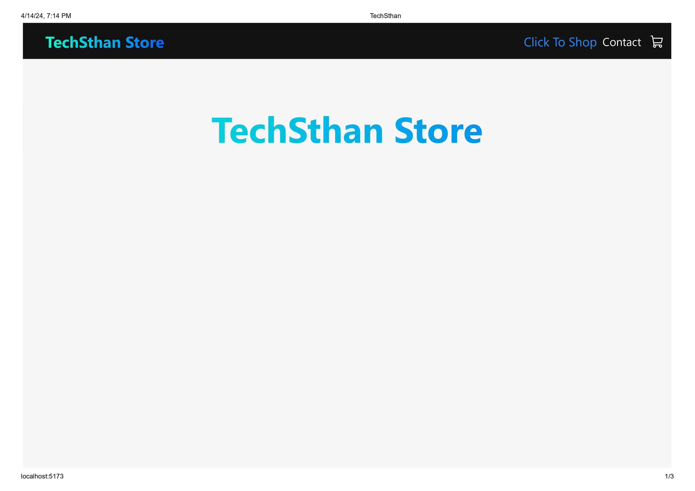
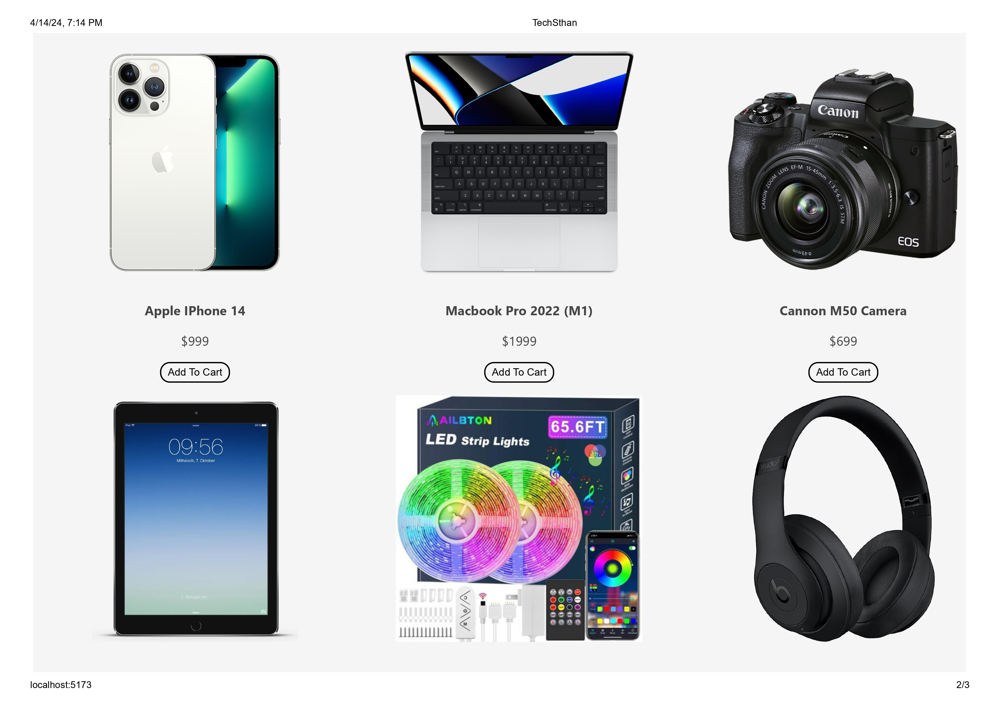
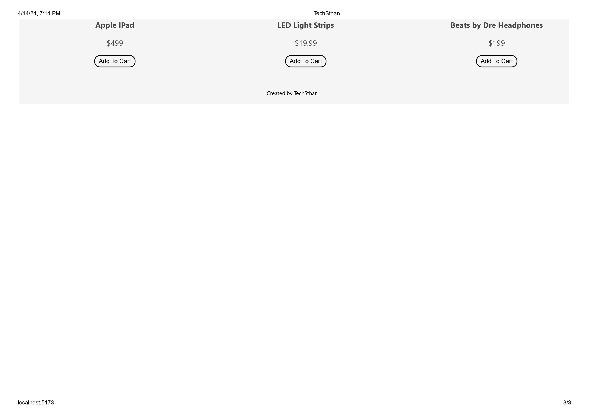
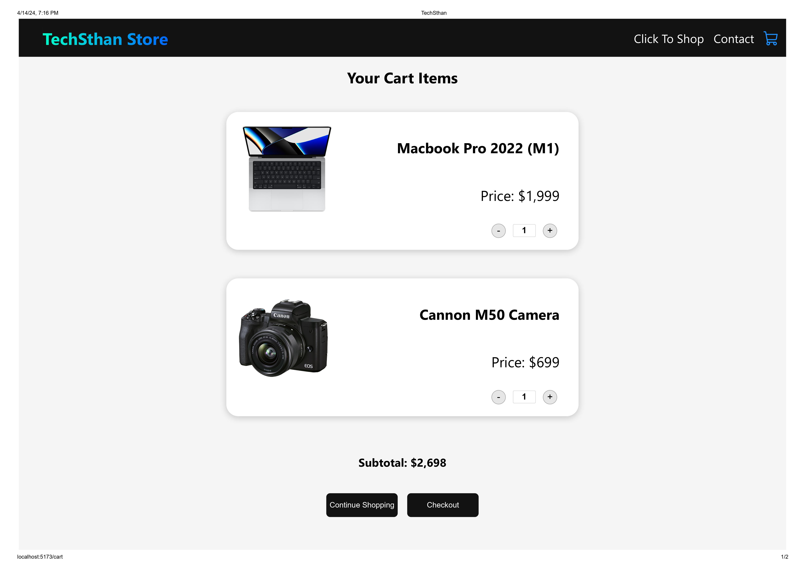

## Task 2 MERN E-Commerce Application

# Description
Build a full-stack E-commerce app using MongoDB, Express, React, and Node (MERN stack). Features include user registration and login, product searching with filters, cart management, online payments, address input, and product reviews. Enhance your resume with this advanced-level React project.

